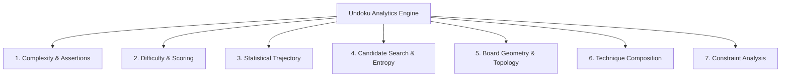

Undoku replaces subjective heuristic ratings with a **deterministic, mathematically rigorous cognitive difficulty engine**. Rather than relying on simple clue counts or brute-force trial-and-error backtracking, Undoku measures the exact cognitive search space, logical proof burden, candidate eliminations, and statistical trajectory required for a human to solve each step.

---

## 1. Cognitive Assertion Model

A central breakthrough in Undoku is **Logical Assertion Counting** ($A_i$)—measuring *how many distinct logical constraints, peer interactions, and candidate disqualifications must be evaluated to arrive at a definite deduction for step $i$*.

### A. Naked Single Deduction
A cell $(r, c)$ is a Naked Single if 8 of the 9 candidate digits are eliminated by filled peers in its row, column, or $3 \times 3$ box.

To accurately model human perception, Undoku computes the **minimum unfilled degrees of freedom** across the cell's three intersecting units:

$$\text{open}_{\min}(r, c) = \min\Big(\text{OpenCells}(\text{Row}_r),\, \text{OpenCells}(\text{Col}_c),\, \text{OpenCells}(\text{Box}_{r,c})\Big)$$

The assertion count $A_{\text{Naked}}$ scales dynamically with $\text{open}_{\min}$:

$$A_{\text{Naked}} = \begin{cases} 
2 & \text{if } \text{open}_{\min} \le 1 \\
4 & \text{if } \text{open}_{\min} = 2 \\
6 & \text{if } \text{open}_{\min} = 3 \\
9 & \text{if } \text{open}_{\min} = 4 \\
12 & \text{if } \text{open}_{\min} = 5 \\
15 & \text{if } \text{open}_{\min} = 6 \\
\min\big(22,\, 16 + 2 \cdot (\text{open}_{\min} - 6)\big) & \text{if } \text{open}_{\min} \ge 7
\end{cases}$$

The step score is directly derived from assertion intensity:

$$\text{StepScore}_{\text{Naked}} = 1.00 + \left(\frac{A_{\text{Naked}}}{22.0}\right) \times 0.75 \quad \in [1.06,\, 1.75]$$

---

### B. Hidden Single in $3 \times 3$ Box
A digit $v \in [1, 9]$ is a Hidden Single in a $3 \times 3$ Box if only one unfilled cell $(r, c)$ in that box can legally host $v$.

To prove $v$ belongs uniquely in $(r, c)$, the solver must inspect all other open cells in the box and assert orthogonal peer conflicts (row/column cross-eliminations):

$$A_{\text{HiddenBox}} = \max\Big(10,\, \min\big(24,\, \text{round}(8 + 0.40 \cdot \text{PeerEliminations} + 0.30 \cdot \text{Reasons}_{\text{total}})\big)\Big)$$

$$\text{StepScore}_{\text{HiddenBox}} = 1.40 + \left(\frac{A_{\text{HiddenBox}}}{24.0}\right) \times 0.45 \quad \in [1.58,\, 1.85]$$

---

### C. Hidden Single in Line (Row or Column)
A digit $v$ is a Hidden Single in Row $r$ (or Column $c$) if only one cell in the line can legally contain $v$. Proving line uniqueness requires scanning intersecting $3 \times 3$ boxes and perpendicular lines:

$$A_{\text{HiddenLine}} = \max\Big(15,\, \min\big(32,\, \text{round}(12 + 0.45 \cdot \text{PeerEliminations} + 0.35 \cdot \text{Reasons}_{\text{total}})\big)\Big)$$

$$\text{StepScore}_{\text{HiddenLine}} = 1.75 + \left(\frac{A_{\text{HiddenLine}}}{32.0}\right) \times 0.50 \quad \in [1.98,\, 2.25]$$

---

## 2. Aggregate Scoring & Multi-Factor Calculus

For a puzzle with $N$ carved blank cells, solved in $N$ sequential logical steps:

### Total Logical Score
$$\text{TotalScore} = \sum_{i=1}^{N} \text{StepScore}_i$$

### Total Assertions
$$A_{\text{total}} = \sum_{i=1}^{N} A_i$$

### Mean Step Assertions
$$\bar{A} = \frac{1}{N} \sum_{i=1}^{N} A_i = \frac{A_{\text{total}}}{N}$$

### Composite Cognitive Index
Combining aggregate difficulty score, total assertion volume, average cognitive load, and statistical score variance:

$$\text{CompositeScore} = 0.60 \cdot \text{TotalScore} + 0.08 \cdot A_{\text{total}} + 1.50 \cdot \bar{A} + 2.00 \cdot \sigma^2$$

---

## 3. Statistical Trajectory & Pacing Analytics

Let $S = (S_1, S_2, \dots, S_N)$ be the time-ordered sequence of deduction scores across the solve path.

```
          [ OPENING FOOTHOLDS ]          [ CRUCIBLE SPIKES ]          [ CASCADE ENDGAME ]
  Step:  S1  S2  S3  S4  S5  S6  ...   S24   S25   S26   S27   ...   S48   S49   S50  ... S56
  Tier:  🟢  🟢  🟡  🟢  🟡  🟢  ...   🔴    🟠    🔴    🟠   ...   🟢    🟢    🟢  ...  🟢
```

| Metric | Mathematical Formulation | Description |
|---|---|---|
| **Score Mean ($\mu$)** | $\mu = \frac{1}{N} \sum_{i=1}^N S_i$ | Average step difficulty across the game. |
| **Score Spread** | $\Delta S = \max(S_i) - \min(S_i)$ | Dynamic range between easiest and hardest steps. |
| **Score Variance ($\sigma^2$)** | $\sigma^2 = \frac{1}{N} \sum_{i=1}^N (S_i - \mu)^2$ | Volatility and dispersion of step difficulty. |
| **Standard Deviation ($\sigma$)** | $\sigma = \sqrt{\sigma^2}$ | Root mean square deviation of step scores. |
| **Mean Absolute Deviation (MAD)** | $\text{MAD} = \frac{1}{N} \sum_{i=1}^N \|S_i - \mu\|$ | Average deviation from median difficulty. |
| **Suddenness Jump** | $J_{\max} = \max_{1 \le i < N} \|S_{i+1} - S_i\|$ | Sharpest adjacent step difficulty spike. |
| **Bottleneck Step Index** | $i_{\text{bottleneck}} = \text{argmax}_{i} (S_i)$ | 1-indexed step where peak cognitive load occurs. |
| **OLS Pacing Slope ($\beta$)** | $\beta = \frac{\sum_{i=1}^N (i - \bar{i})(S_i - \bar{S})}{\sum_{i=1}^N (i - \bar{i})^2}$ | Linear regression trajectory slope. |

### Pacing Classification
- **Volatile**: $J_{\max} \ge 1.20$ (Extreme spikes interspersed with easy singles).
- **Escalating**: $\beta > +0.030$ (Difficulty steadily increases as the puzzle progresses).
- **Front-Loaded**: $\beta < -0.030$ (Crucible breakthrough occurs early; end dissolves fast).
- **Balanced**: $-0.030 \le \beta \le +0.030$ (Harmonious rhythm across footholds and endgame).

---

## 4. Comprehensive Categorized Metrics (All 7 Domains)

Undoku exports **28 standardized analytical parameters** categorized into 7 domains:



### 1. Complexity & Assertions
- `complexity_total_assertions`: Total candidate eliminations and cross-checks ($A_{\text{total}}$).
- `complexity_max_step_assertions`: Peak step proof burden ($\max A_i$).
- `complexity_avg_assertions_per_step`: Mean proof burden per step ($\bar{A}$).
- `complexity_assertion_density`: Assertions per blank cell ($A_{\text{total}} / N$).
- `complexity_rating`: Composite workload index ($0.4 A_{\text{total}} + 3.5 \bar{A} + 0.8 \max A_i$).

### 2. Difficulty & Scoring
- `score_total`: Sum of all individual step scores ($\sum S_i$).
- `score_composite`: Multi-factor composite rating ($C$).
- `difficulty_rating`: Canonical tier (`Easy`, `Medium`, `Hard`, `Expert`).
- `granular_tier`: Fine-grained 8-tier classification (e.g. `Expert (Tier 2 - Extreme)`).

### 3. Statistical Trajectory
- `trajectory_min_step_score`: Lowest single step score ($\min S_i$).
- `trajectory_max_step_score`: Highest single step score ($\max S_i$).
- `trajectory_score_spread`: Difference between peak and baseline ($\Delta S$).
- `trajectory_score_variance`: Step score variance ($\sigma^2$).
- `trajectory_score_std_dev`: Step score standard deviation ($\sigma$).
- `trajectory_score_divergence`: Mean absolute deviation ($\text{MAD}$).
- `trajectory_suddenness`: Peak consecutive step difficulty jump ($J_{\max}$).
- `trajectory_bottleneck_step`: Step index containing the hardest deduction.
- `trajectory_pacing_slope`: Linear pacing regression slope ($\beta$).
- `trajectory_difficulty_pacing`: Pacing category (*Balanced*, *Escalating*, *Front-Loaded*, *Volatile*).

### 4. Candidate Search Space & Entropy
- `search_avg_candidates`: Mean unresolved candidate count per empty cell ($2.5 + 2.0 \cdot N / 81$).
- `search_peak_ambiguity`: Maximum candidate branching depth before resolution.
- `search_constrainedness`: Fraction of unsolved board degrees of freedom ($1.0 - \text{Clues} / 81$).

### 5. Board Geometry & Topology
- `topology_clue_count`: Number of given starting clues ($81 - N$).
- `topology_blanks_count`: Number of empty cells to solve ($N$).
- `topology_clue_symmetry`: Maximum geometric symmetry score across $180^\circ$, horizontal, vertical, and diagonal axes ($\max(S_{180}, S_h, S_v, S_d) / 81$).
- `topology_distribution_variance`: Clue dispersion variance across all rows, columns, and boxes.
- `topology_box_congestion_max`: Maximum clues concentrated in any single $3 \times 3$ box.
- `topology_band_congestion_max`: Maximum clues in any 3-row horizontal band or vertical stack.

### 6. Technique Composition & Streaks
- `tech_naked_singles`: Count of Naked Single deductions.
- `tech_hidden_singles_box`: Count of Hidden Singles found in $3 \times 3$ boxes.
- `tech_hidden_singles_row_col`: Count of Hidden Singles found in lines.
- `tech_diversity`: Shannon entropy of technique utilization ($-\sum p_t \ln p_t / \ln 4$).
- `tech_max_streak`: Longest consecutive run using the identical deduction technique.
- `tech_max_streak_technique`: Name of the technique used in the longest streak.
- `tech_most_frequent_technique`: Most utilized technique in the solve.
- `tech_least_frequent_technique`: Least utilized technique in the solve.

### 7. Constraint Analysis
- `constraint_cross_horizontal`: Total horizontal row peer constraints checked.
- `constraint_cross_vertical`: Total vertical column peer constraints checked.
- `constraint_box_3x3`: Total $3 \times 3$ box constraints evaluated.
- `constraint_total_reasons`: Aggregate constraint interactions ($H + V + B$).

---

## 5. Calibrated Difficulty Ratings & Granular Tiers

Undoku maps aggregate score, blank count, and peak assertion complexity to **4 Canonical Ratings** and **8 Granular Challenge Tiers**:

| Canonical Rating | Granular Challenge Tier | Blank Cells | Given Clues | Total Score Range | Peak Assertions |
| :--- | :--- | :---: | :---: | :---: | :---: |
| **🟢 Easy** | **Easy (Tier 1 - Casual)** | $40 - 42$ | $39 - 41$ | $< 44.0$ | $4 - 8$ |
| **🟢 Easy** | **Easy (Tier 2 - Novice)** | $42 - 45$ | $36 - 39$ | $44.0 - 49.9$ | $8 - 12$ |
| **🟡 Medium** | **Medium (Tier 1 - Moderate)** | $47 - 49$ | $32 - 34$ | $50.0 - 55.9$ | $10 - 14$ |
| **🟡 Medium** | **Medium (Tier 2 - Intermediate)** | $49 - 52$ | $29 - 32$ | $56.0 - 61.9$ | $12 - 16$ |
| **🟠 Hard** | **Hard (Tier 1 - Advanced)** | $53 - 55$ | $26 - 28$ | $62.0 - 67.9$ | $14 - 18$ |
| **🟠 Hard** | **Hard (Tier 2 - Master)** | $55 - 57$ | $24 - 26$ | $68.0 - 73.9$ | $16 - 20$ |
| **🔴 Expert** | **Expert (Tier 1 - Grandmaster)** | $58 - 60$ | $21 - 23$ | $74.0 - 79.9$ | $18 - 22$ |
| **🔴 Expert** | **Expert (Tier 2 - Extreme)** | **$60 - 64$** | **$17 - 21$** | **$\ge 80.0$** | **$\ge 20$** |

---

## 6. Polar Spike Graph Transformation Math

The interactive feature graph renders step trajectories on a 2D polar canvas:

```
          12 o'clock: S1 (Start)
                  ▲
             . - ~ ~ - .
         . '      |      ' .
       /          |          \
      |     (Core Hub)        |
       \          |          /
         . _      |      _ .
             ' - _|_ _ - '
                  ▼
          6 o'clock: S(N/2) (Midway)
```

For step index $i \in [0, N - 1]$:

### Polar Angle
$$\theta_i = -\frac{\pi}{2} + \left(\frac{i}{N}\right) \cdot 2\pi$$

### Cognitive Intensity Normalization
$$\text{ScoreNorm}_i = \max\left(0,\, \min\left(1.0,\, \frac{S_i - 1.00}{1.35}\right)\right)$$

$$\text{AstNorm}_i = \max\left(0,\, \min\left(1.0,\, \frac{A_i - 2}{22}\right)\right)$$

$$\text{Intensity}_i = \max\Big(0.08,\, \min\big(1.00,\, 0.55 \cdot \text{ScoreNorm}_i + 0.45 \cdot \text{AstNorm}_i\big)\Big)$$

### Cartesian Coordinate Mapping
$$r_i = r_{\text{hub}} + \text{Intensity}_i \cdot (r_{\max} - r_{\text{hub}})$$

$$x_i = c_x + r_i \cos\theta_i, \qquad y_i = c_y + r_i \sin\theta_i$$

### Radial Spike Stem
A direct vector drawn from $(c_x + r_{\text{hub}}\cos\theta_i,\, c_y + r_{\text{hub}}\sin\theta_i)$ to $(x_i, y_i)$, with line width scaling by assertion volume:

$$w_i = 1.20 + \min\left(2.80,\, \frac{A_i}{24.0} \times 2.20\right) \quad \in [1.20,\, 4.00]\text{px}$$


